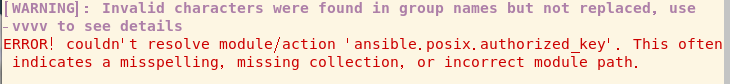
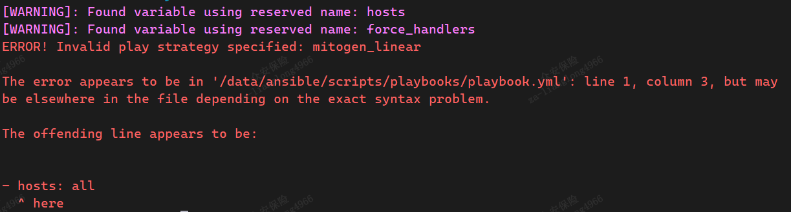

# 基础部署

安装平台地址： 
```
https://docs.ansible.com/ansible/latest/installation_guide/intro_installation.html#installing-ansible-on-debian
```

## 安装ansible
```sh
yum -y install epel-release
yum list all *ansible*
yum info ansible
yum -y install ansible
```

## Ansible 配置文件
```sh
/etc/ansible/ansible.cfg    # 主配置文件
/etc/ansible/hosts          # Inventory  主机配置文件
/usr/bin/ansible-doc        # 帮助文件
/usr/bin/ansible-playbook   # 指定运行任务文件
```

## mitogen strategy 插件
提高ansible的执行效率，比原生执行速度提高1.25x-7x，CPU减少2倍的使用。

下载
```sh
wget https://networkgenomics.com/try/mitogen-0.2.9.tar.gz
tar zxf mitogen-0.2.9.tar.gz /path/to/
```
在 ansible.cfg 中配置

```ini
[defaults]
strategy_plugins = /path/to/mitogen-0.2.9/ansible_mitogen/plugins/strategy
strategy = mitogen_linear

```
也可在play中设置
```
- hosts: web-servers
  strategy: mitogen_linear
```
执行
```
ANSIBLE_STRATEGY_PLUGINS=/path/to/mitogen-0.2.9/ansible_mitogen/plugins/strategy ansible-playbook test.yaml
```

## 密钥对生产

```sh
ssh-keygen -t rsa -C "your_email@example.com"
#
# -t = The type of the key to generate
# 密钥的类型
# -C = comment to identify the key
# 用于识别这个密钥的注释
#
# 密钥复制到其他机器
ssh-copy-id -i ~/.ssh/id_rsa.pub user@server
```

## ansible 错误
**- 错误1 找不到相关模块包**

```sh
#  ansible 2.9.7 版本
ERROR! couldn't resolve module/action 'ansible.posix.authorized_key'. This often indicates a misspelling, missing collection, or incorrect module path.
```


**原因：**

ansible 的核心包不存在了，需要安装.

This module is part of the `ansible.posix` collection (version 1.3.0).
You might already have this collection installed if you are using the `ansible` package. It is not included in `ansible-core`. To check whether it is installed, run `ansible-galaxy collection list`.
To install it, use: `ansible-galaxy collection install ansible.posix`.
To use it in a playbook, specify:` ansible.posix.firewalld`.

- 类似的 module 缺失的情况，都可以安装解决
```sh
ansible-galaxy collection install community.general
```

**- 使用ansible 的 Mitogen for Ansible 插件出现导包错误**
**现象**
```
[WARNING]: Found variable using reserved name: hosts
[WARNING]: Found variable using reserved name: force_handlers
ERROR! Unexpected Exception, this is probably a bug: No module named ansible_mitogen.loaders

ansible.cfg 配置
[defaults]
strategy_plugins = /path/to/mitogen-0.2.9/ansible_mitogen/plugins/strategy
strategy = mitogen_linear
```
**解决:**
```sh
修改路径中文件夹版本号的命名
[defaults]
# 路径也可以使用相对路径
# strategy_plugins = ./mitogen/ansible_mitogen/plugins/strategy
strategy_plugins = /path/to/mitogen/ansible_mitogen/plugins/strategy
strategy = mitogen_linear
```

**- mitogen 指定策略时会报错**
**现象**

**解决**

```sh
strategy_plugins = /path/to/mitogen/ansible_mitogen/plugins/strategy
# 将策略信息注释掉
# strategy = mitogen_linear
# mitogen_linear: 对应原生的linear
# mitogen_free: 对应原生的free
# mitogen_host_pinned: 对应原生的host_pinned
```

**Ansible官方提供了几个可用于计时的回调插件**
```
(1).profile_tasks：该回调插件用于计时每个任务的执行时长
(2).profile_roles插件用于计时每个Role的执行时长
(3).timer插件用于计时每个play执行时长
```
要使用这些插件，需要在ansible.cfg配置文件中的callback_whitelist中加入各插件。如下：
```ini
[defaults]
callback_whitelist = profile_tasks
# callback_whitelist = profile_tasks, profile_roles, timer
```